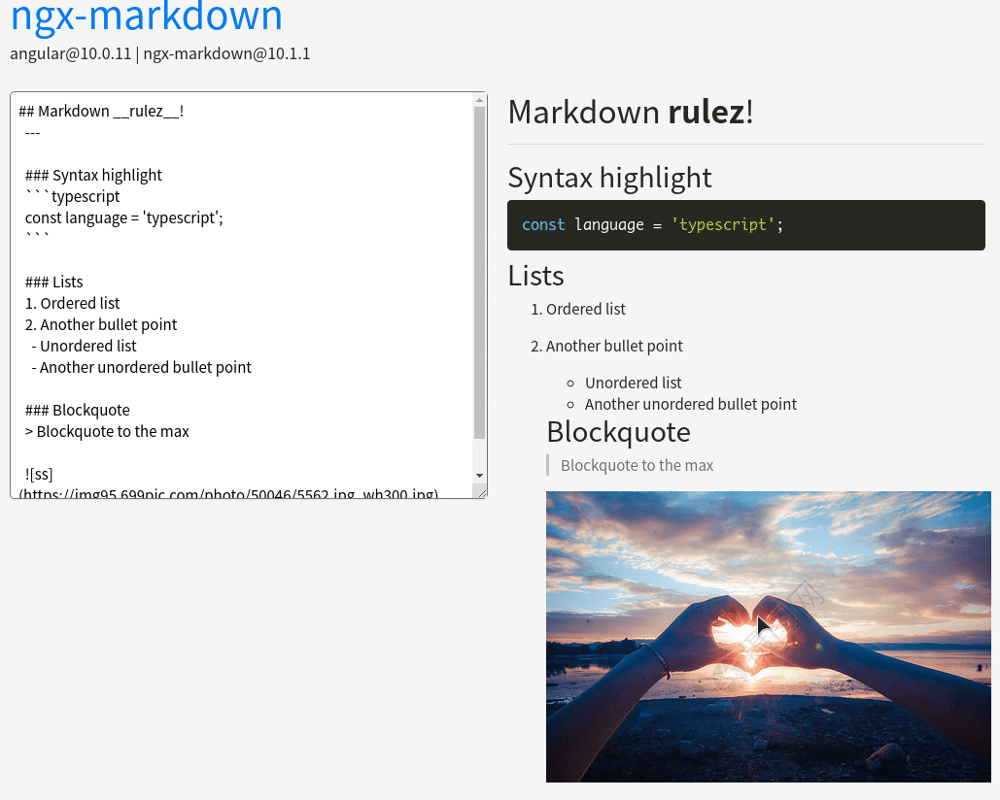

# ngx-imgclicker [](https://badge.fury.io/js/%40flywine93%2Fngx-imgclicker) [](https://github.com/996icu/996.ICU/blob/master/LICENSE)

[](https://nodei.co/npm/@flywine93/ngx-imgclicker/)


## Installation

```
npm i @flywine93/ngx-imgclicker -S
npm i panzoom -S
```

## Usage

1.Import module into App Module.

```
import { NgxImgclickerModule } from 'ngx-imgclicker';


@NgModule({
  declarations: [
    AppComponent,
  ],
  imports: [
    BrowserModule,
    AppRoutingModule,
    CommonModule, // import
    NgxImgclickerModule // import
  ],
  providers: [],
  bootstrap: [AppComponent]
})
export class AppModule { }
```
2.demo

```
<p style="text-align:center;">Test ngx-imgclicker</p>


<ngx-imgclicker></ngx-imgclicker>
```

